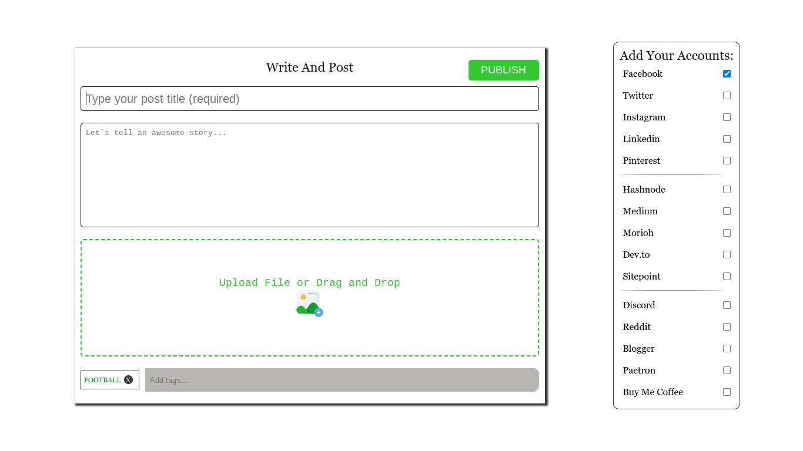

# Outpost
In the project directory, you can run:
### `npm install`
then
### `npm start`
Runs the app in the development mode.
### `npm run build`
Builds the app for production to the `build` folder.\
It correctly bundles React in production mode and optimizes the build for the best performance.
Your app is ready to be deployed!
 
 

- preview Image

# Outpost
